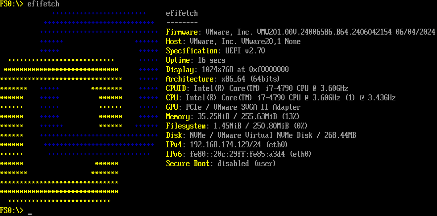

# efifetch

**efifetch** is a UEFI application that displays system information and vendor logos in the UEFI environment. It is lightweight, portable, and compatible with various platforms.



## Run

### Get efifetch

You can either [build efifetch from source](#build-from-source) or download it from the [release page](https://github.com/BigfootACA/efifetch/releases).

### Determine your device architecture

- AMD and Intel computers (most): x86_64 / X64
- Older Intel Atom with 32-bit UEFI: i386 / IA32
- Raspberry Pi or U-Boot based EFI: aarch64 / ARM64
- Snapdragon tablets/laptops, WoA phones: aarch64 / ARM64
- ARM SBSA-based servers and computers (Ampere, Hisilicon): aarch64 / ARM64

### Install efifetch

1. Prepare a USB drive formatted with FAT32.
2. Copy the efifetch binary (e.g., `efifetch-x86_64.efi`) to the FAT32 volume.
3. Copy the EFI Shell binary (e.g., `shell-x86_64.efi`) to the FAT32 volume.

**Note:** To make the USB drive boot directly into the EFI Shell, rename `shell-x86_64.efi` as follows:
- x86_64:  `EFI\BOOT\BOOTX64.EFI`
- i386:    `EFI\BOOT\BOOTIA32.EFI`
- aarch64: `EFI\BOOT\BOOTAA64.EFI`

### Run efifetch

1. Boot your device into the EFI shell.
2. Locate your USB drive's FAT32 volume using the `map` command.
3. Switch to the target volume (e.g., `FS0:`).
4. Execute the efifetch binary (e.g., `efifetch-x86_64`).

## Build from source

There are multiple ways to build efifetch. Choose the method that best fits your environment.

### Build directly under Linux (Recommended)

```sh
make -j $(nproc)
```

The output binary will be located at `build/efifetch.efi`

### Build with Tianocore EDK II

```bash
git clone https://github.com/tianocore/edk2
make -C edk2/BaseTools
export PACKAGES_PATH="$PWD:$PWD/edk2"
export EDK_TOOLS_PATH="$PWD/edk2/BaseTools"
source edk2/edksetup.sh
build -a X64 -t GCC5 -b RELEASE -p efifetch/efifetch.dsc
```

or

```bash
git clone https://github.com/tianocore/edk2
make build-edk2
```

The output binary will be located at `Build/efifetch/RELEASE_GCC5/X64/efifetch.efi`
